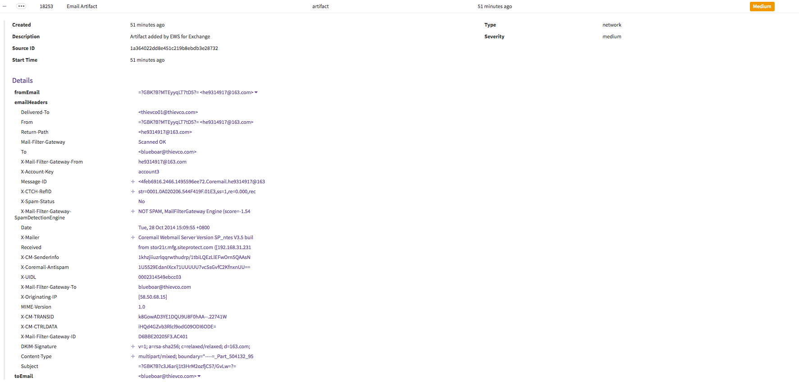
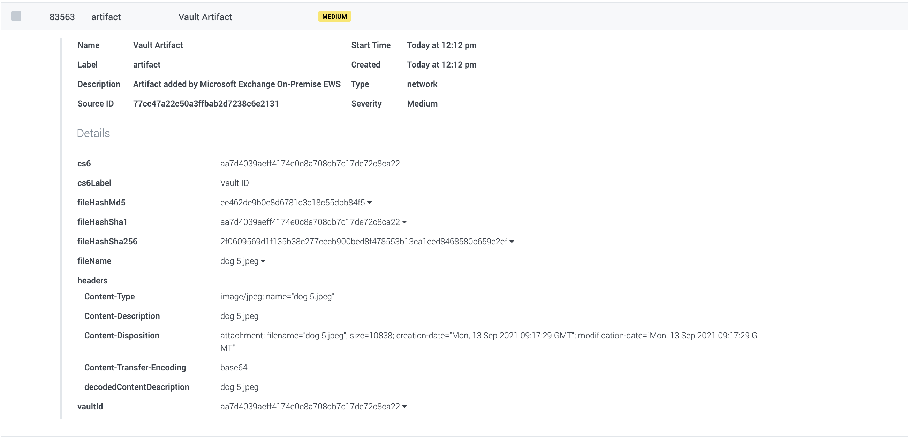

[comment]: # " File: README.md"
[comment]: # "  Copyright (c) 2016-2023 Splunk Inc."
[comment]: # ""
[comment]: # "Licensed under the Apache License, Version 2.0 (the 'License');"
[comment]: # "you may not use this file except in compliance with the License."
[comment]: # "You may obtain a copy of the License at"
[comment]: # ""
[comment]: # "    http://www.apache.org/licenses/LICENSE-2.0"
[comment]: # ""
[comment]: # "Unless required by applicable law or agreed to in writing, software distributed under"
[comment]: # "the License is distributed on an 'AS IS' BASIS, WITHOUT WARRANTIES OR CONDITIONS OF ANY KIND,"
[comment]: # "either express or implied. See the License for the specific language governing permissions"
[comment]: # "and limitations under the License."
[comment]: # ""
Use the Microsoft Exchange On-Premise EWS app to access a user's mailbox via EWS XML SOAP calls on
an on-premise Exchange server. This can be done through impersonation, or high-level permissions. To
use Splunk Phantom to organize and gain insights from email data, you need to install and connect
Splunk Phantom to the Microsoft Exchange On-Premise EWS app.

## Impersonation and privileges

When using impersonation, the app uses the current user to impersonate the target user to perform
commands in the mailboxes the target user has access to. This can be configured in the user
interface. When using high level permissions, many organizations configure an Exchange administrator
account that has access to certain mailboxes. To give access to a user's mailbox to another user,
use the **Add-MailboxPermission** PowerShell cmdlet on the Exchange Server.

## Configuration

-   EWS URL: The URL configured by the person that set up the Exchange server.
-   EWS Version: Ensure the version in the dropdown corresponds to the version of Exchange you have
    installed. 
-   Username and Password: Use the username and password that have the correct privileges to access
    other mailboxes. 
-   (Optional) User Email Mailbox: The mailbox you will ingest data from if you use polling and to
    test connectivity. 
-   (Optional) Script with functions to preprocess containers and artifacts: The user can add a
    script file in the configuration parameter. The script must contain a function with the name
    **preprocess_container** (to pre-process the containers and the artifacts) else it will throw an
    error. The script should not contain **run_automation** (or any other logic to trigger active
    playbooks) since the app automatically handles the triggering. The implementation will first
    process the container according to the script and save it. The artifacts are then added to the
    container, processed, and saved in that order. Hence, when adding a script to process artifacts,
    verify if artifacts are present in the container before modifying them. 
-   On poll information: Configure your desired on poll settings. For example, how to ingest, the
    number of emails to poll, what type of information you want to extract, and once extracted, your
    desired level of container severity. For more information on using on poll data ingestion, see
    Use on poll data ingestion. 

## POLL NOW

POLL NOW should be used to get a sense of the containers and artifacts that are created by the app.
The POLL NOW window allows the user to set the "Maximum containers" that should be ingested at this
instance. Since a single container is created for each email, this value equates to the maximum
emails that are ingested by the app. The app will either get the oldest email first or the latest,
depending upon the configuration parameter *How to ingest* . The date used to determine the oldest
or latest is what EWS calls **item:LastModifiedTime** and **item:DateTimeCreated** , which is
dependent on the parameter *Sort mails by* . If an email that arrived a week ago, is moved from one
folder to the folder being ingested, its LastModifiedTime will be set to the time that it was moved.
But, its DateTimeCreated will be the same.  
  
**Note:**

-   "Mailbox folder to be polled" parameter is case-sensitive.
-   The "Container Severity" value set in the asset configuration parameter will be applicable to
    the container as well as all the artifacts created inside the container.

## Scheduled Polling

This mode is used to schedule a polling action on the asset at regular intervals, which is
configured via the INGEST SETTINGS tab of the asset. It makes use of the following asset
configuration parameters (among others):

-   Maximum emails to poll the first time

      
    The app detects the first time it is polling an asset and will ingest this number of emails (at
    the most).

-   Maximum emails to poll

      
    For all scheduled polls after the first, the app will ingest this number of emails.

-   How to ingest

      
    Should the app be ingesting the latest emails or the oldest.

In the case of Scheduled Polling, on every poll, the app remembers the last email that it has
ingested and will pick up from the next one in the next scheduled poll.

### How to ingest

The app allows the user to configure how it should ingest emails on every scheduled poll either in
the *oldest first* or the *latest first* order. Depending upon the scheduled interval and how busy
the folder is, one of the following could potentially happen

-   oldest first

      
    If the app is configured to poll too slowly and the folder is so busy that on every poll the
    maximum ingested emails is less than the number of new emails, the app will never catch up.

-   latest first

      
    If the app is configured to poll too slowly and the folder is so busy that on every poll the
    maximum ingested emails is less than the number of new emails, the app will drop the older
    emails since it is ingesting the latest emails that came into the mailbox.

For best results, keep the poll interval and *Maximum emails to poll* values close to the number of
emails you would get within a time interval. This way, every poll will end up ingesting all the new
emails.

### Sort mails by

This parameter defines on which email attribute, the order *latest first* / *oldest first* should be
applied. The user can configure it to any of the below values.

-   updated time

      
    The application will fetch and ingest emails with the latest updated time field of the email
    attribute.

-   created time

      
    The application will fetch and ingest emails with the created time field of the email attribute.
    Be careful while using this option, as the application fetches the emails by the created time,
    any update made on the email after ingestion, will not be reflected in the phantom container.

  

In case the asset is configured to poll **oldest first** , it becomes important that the *Maximum
number of emails to poll* configured should be greater than the maximum number of emails generated
**per second** . If the app detects it got the maximum configured emails and all occurred in the
same second, it will start polling from the next second in the next polling cycle.

### Save raw email content to container

This asset configuration parameter determines whether or not the raw email content of the ingested 
email will be saved to the container. If the box is checked, the raw email data will be saved to the 
**data** dictionary. The default setting is TRUE.

### Run automation on duplicate event

Set this parameter to run the automation, when there is a modification in the email which is already
ingested. If you don't want to trigger the automation for such small changes (in case of
re-ingestion), this parameter can be set to FALSE.

## Important points regarding scheduled polling

-   The accuracy of "scheduled polling" can't be assured for lower polling intervals. The variance
    of +/-2 minutes is acceptable in the current implementation.

-   The interval period must be set considering various aspects. Anything below 5 minutes can be
    considered as less accurate.

-   One can separate out the mail boxes to increase the accuracy of polling. For example, inbox,
    drafts and other folders. This allows multiple ingestions on different assets by keeping longer
    interval period (i.e. 5 minutes), rather than a single asset with 1 minute interval period.

-   When the ingestion time takes longer than the interval period( i.e. When the interval period is
    1-minute, and it takes 2 minutes to ingest an email), In this case, the following scenarios are
    possible.

      

    -   The timing can not be exact, as one ingestion must complete before the timer is resumed.
    -   It is also possible that even after turning off the scheduled polling, some emails would be
        ingested as the emails are queued when the ingestion takes longer than the period.
    -   Hence, it is important to set the appropriate ingestion period as per your data.

## Artifacts created

The app will create the following type of artifacts:

-   Email Artifact

      
    The email addresses that are found in the ingested email will be added as a separate artifact.
    Any attached email will also be scanned and the address present in the attached email will be
    added as a separate artifact. The emails are added as custom strings in the CEF structure in the
    following manner.  

    | **Artifact Field** | **Value Details**                                                                 |
    |--------------------|-----------------------------------------------------------------------------------|
    | fromEmail          | The email address of the sender                                                   |
    | toEmail            | The email address of the receiver of the email                                    |
    | emailHeaders       | A dictionary containing each email header as a key and its value as the key-value |

      
    [](img/email_artifact.png)

-   IP Artifact - cef.sourceAddress

      

    -   If **extract_ips** is enabled, any IPv4 or IPv6 found in the email body will be added, with
        one CEF per IP.
    -   Any IP addresses found in the email are added to the CEF structure of an artifact.
    -   The CEF for an IP is cef.sourceAddress.

-   Hash Artifact - cef.fileHash

      

    -   If **extract_hashes** is enabled, any hash found in the email body will be added, with one
        CEF per hash.
    -   Any Hashes found in the email are added to the CEF structure of an artifact.
    -   The CEF for a hash is cef.fileHash.

-   URL Artifact - cef.requestURL

      

    -   If **extract_urls** is enabled, any URL found in the email body will be added, with one CEF
        per url.
    -   Any URLs or hyperlinks found are added to the CEF structure of an artifact.
    -   The CEF for a URL is cef.requestURL.

-   Domain Artifact - cef.destinationDnsDomain

      

    -   If **extract_domains** is enabled, any domain found in the email body will be added, with
        one CEF per domain.
    -   Domains that are part of a URL, a hyperlink or an email address are added to the CEF
        structure of an artifact.
    -   The CEF for a Domain is cef.destinationDnsDomain.

-   Vault Artifact

    -   If the email contains any attachments, these are extracted (if **extract_attachments** is
        enabled) and added to the vault of the Container.
    -   At the same time, the vault ID and file name of this item is represented by a Vault
        Artifact.
    -   Some special characters will be removed from the file name before ingestion. Such as
        comma(,), single quote(') and double quote(").
    -   The same file can be added to the vault multiple times. In this scenario, the file name of
        the item added the second time onwards will be slightly different, but the vault ID will
        still be the same. However, there will be multiple artifacts created.
    -   Do note that the system does *not* duplicate the file bytes, only the metadata in the
        database.
        | **Artifact Field** | **Value Details**                                                                |
        |--------------------|----------------------------------------------------------------------------------|
        | Source ID          | Email ID set on the server                                                       |
        | cef.vaultId        | Vault ID of the attachment                                                       |
        | cef.fileHashMd5    | MD5 hash of the attachment                                                       |
        | cef.fileHashSha1   | SHA1 hash of the attachment                                                      |
        | cef.fileHashSha256 | SHA256 hash of the attachment                                                    |
        | cef.fileName       | File name of the attachment                                                      |
        | cef.headers        | A dictionary containing each file header as a key and its value as the key-value |
    -   You will notice additional CEF fields **cs6** (value is the Vault ID) and **cs6Label** .
        These are added for backward compatibility only and will be deprecated in future releases.
        Please don't use these keys in playbooks.

      
    [](img/vault_artifact.png)

## Copy Email

To use the copy email command, follow these steps:

1.  Navigate to the Investigation page. 
2.  Click **Action** .
3.  In the search bar, search for the copy email command.
4.  Click **copy email** . 
5.  Click **exchange,** or whatever asset name you created, as the asset you want to run the **copy
    email** command on. 
6.  Enter the ID. Each email in Exchange has a unique ID. You can get this email ID from an email
    artifact that was previously ingested, or by running a run query action. 
7.  Enter the email address of the user you want to copy the email from and the folder you want to
    copy the email to.
8.   From the message ID, click the drop down arrow and click **Run Action** .
9.  Enter the email and the folder you want to move it to. 
10.  Click **Launch** . 

### Preprocessing Containers

It is possible to upload your own script which has functions to handle preprocessing of containers.
The artifacts which are going to be added with the container can be accessed through this container
as well. This function should accept a container and return the updated container. Also note that
the name of this function must be **preprocess_container** .

``` shell
import urlparse


def get_host_from_url(url):
    return urlparse.urlparse(url).hostname


def preprocess_container(container):

    # Match urls like https://secure.contoso.com/link/https://www.google.com
    # We want to strip 'https://secure.contoso.com/link/', and instead create
    #  a URL artifact for 'https://www.google.com'
    url_prepend = 'https://secure.contoso.com/link/'
    domain_prepend = 'secure.contoso.com'

    new_artifacts = []

    for artifact in container.get('artifacts', []):
        cef = artifact.get('cef')
        url = cef.get('requestURL')
        if url and url.lower().startswith(url_prepend):
            url = url.replace(url_prepend, '')
            artifact['cef']['requestURL'] = url
            # Create a new domain artifact for this URL
            new_artifacts.append({
                'name': 'Domain Artifact',
                'cef': {
                    'destinationDnsDomain': get_host_from_url(url)
                }
            })

        domain = cef.get('destinationDnsDomain')
        if domain and domain.lower() == domain_prepend:
            # These are the wrong domains, ignore them
            continue

        new_artifacts.append(artifact)

    if new_artifacts:
        new_artifacts[-1]['run_automation'] = True

    container['artifacts'] = new_artifacts
    return container
```

In this example, many of the URLs have 'https://secure.contoso.com/link' appended to the start of
them. These URL artifacts will be tough to use in a playbook without additional processing. On top
of that, all of the associated domain artifacts will be incorrect as well, since they will all point
to 'secure.contoso.com'.

## Port Information

The app uses the HTTP/HTTPS protocol for communicating with the Microsoft Exchange On-Premise EWS
Server. Below are the default ports used by Splunk SOAR.

| Service Name | Transport Protocol | Port |
|--------------|--------------------|------|
| http         | tcp                | 80   |
| https        | tcp                | 443  |

## Playbook Backward Compatibility

With this release, we are removing the asset parameter 'unify_cef_fields', and the CC and BCC CEF
fields will be in uppercase only. In order to avoid confusion, playbooks that use these CEF fields
in lowercase should be updated to uppercase.
